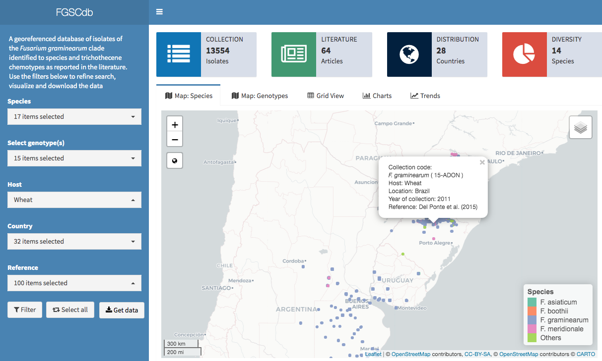

**FGSCdb** is a database of information on characterized fungal strains of *Fusarium graminearum* species complex that encompasses a complex of species that cause head blight or scab of small grain crops, but also ear and stalk rot of maize and panicle blight in rice. Geographic location combined with the information on the year of sampling allows to track the temporal and spatial spread of the pathogen.

The data have been gathered directly from researchers or extracted from the published articles whenever the geographic information can be obtained. We would like to extend the utility of this project by allowing other researches to contribute data to populate the global map. Get in touch ([delponte\@ufv.br](mailto:delponte@ufv.br){.email}) to receive instructions on how to submit your data.

**Author and maintainer**: Emerson M. Del Ponte \
**Maintainer**: Gláucia M. Moreira \
**Collaborators**: Camila P. Nicolli, Todd J. Ward, Cees Waalwijk, Theo van der Lee, Kerry O'Donnell, Sofia N. Chulze, Sebastian A. Steinglein, Dinorah Pan, Silvana Vero, Hao Zhang, Dauri J. Tessmann, Lisa J. Vaillancourt, Antonio Moretti, Antonio Logrieco
